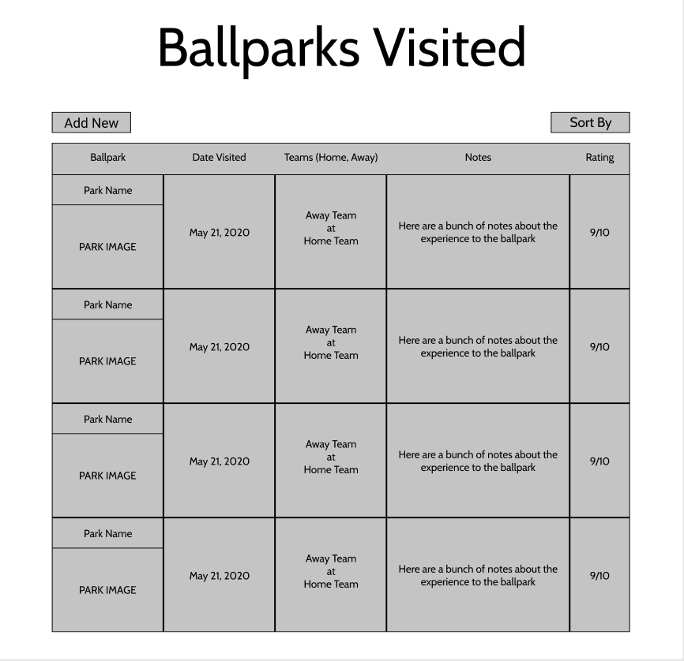
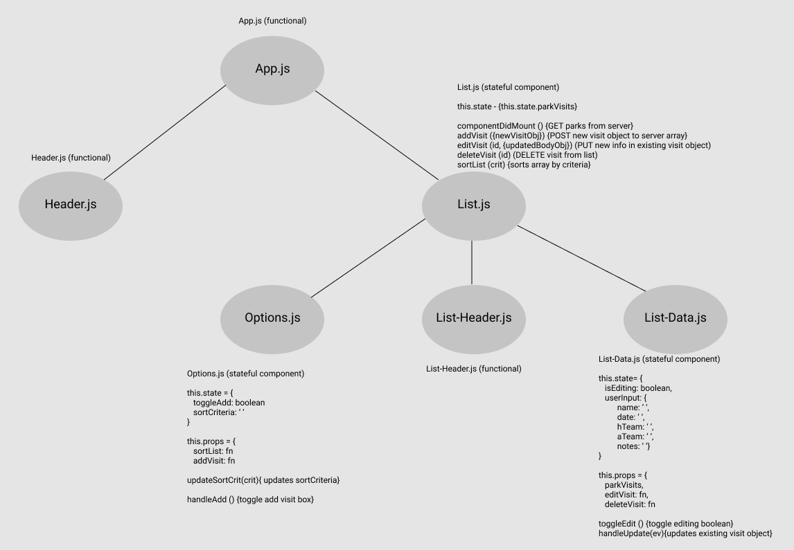

# MLB Ballparks Visited App

## Application Concept and Wireframe

### Application Concept

- This app will track MLB Ballparks visited
- Data will be provided by user
- Will hard code parks already visited
  - Full CRUD
    - GET: Get all parks visited
    - POST: create new objects with newly visited parks info
    - PUT: Update information on existing parks
    - DELETE: Remove listed parks, as needed

### Functionality

- Header at the top of the page will display App name
- When app loads, a list of visited parks will display
  - List can be sorted by:
    - alphabetically
    - rating
    - date
  - Objects in list will contain:
    - rating
    - park name and image
    - date visited
    - Teams
      - home
      - away
    - Notes
  - Buttons will correspond with each object to either edit or delete
  - Add Button will open window allowing new visits
- The list will update when changes are made

### Endpoints

- GET: Obtains existing list of park visits
- POST: Create new objects for visits
- PUT: Update existing objects info
- DELETE: Remove unneeded visits

### Component Architecture

- App.js (functional)
  - Header (functional)
  - List (stateful: hold list of visits, this.state.parkVisits)
    - Options (stateful: sortByInput)
    - List-Headers (functional)
    - List-Data (stateful: editing)

### Wireframe

